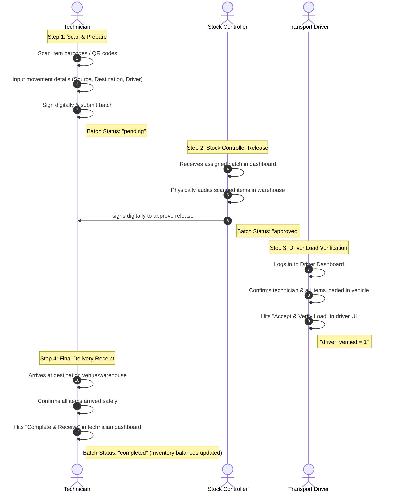

# aBility - Core System Workflows & Lifecycle Documentation

This document provides a comprehensive end-to-end overview of the **aBility Asset Intelligence & Inventory Management System**, mapping out the journey of an asset from user registration and secure authentication to scanning, multi-step approval chains, and actual movements to and from stocks.

---

## 1. Sequence Flowchart: The Lifecycle of a Movement Batch

The diagram below visualizes the digital "handshake" and chain of custody for equipment movement batches:

---

## 2. Step-by-Step System Workflows

### 🔑 Stage A: Registration & Secure Login

The system implements strict **Role-Based Access Control (RBAC)** to ensure accountability.

#### 1. Registration (`register.php`)
* **Information Gathered**: Username, full name, department, role, password, and a **digital signature image**.
* **Roles Available**:
  * `admin`: Full administrative control, system logs, dashboard stats, user permissions.
  * `stock_controller`: Assigned to release items from specific stock warehouses.
  * `technician` / `tech_lead`: Initiates scans, requests gear, and receives it on-site.
  * `driver`: Verification of transport loads and logistics.
* **Signature Capture**: Users upload or draw their digital signature during registration. This image is stored securely under `uploads/signatures/` and dynamically bound to every transaction they authorize.

#### 2. Authentication & Redirection (`login.php` / `dashboard_full.php`)
* Users authenticate using secure session-based credentials.
* **Smart Redirection**:
  * **Drivers** are immediately redirected to the simplified **Driver Dashboard** (`driver_batches.php`) to view active transport batches.
  * **Technicians** go to the **Technician Dashboard** or scan page.
  * **Stock Controllers** and **Admins** access the comprehensive control centers.

---

### 📷 Stage B: Scan Item(s) (`scan_bulk.php` / `mobile_scan.php`)

Technicians utilize the scanning engine to record items in real-time, preventing manual data entry errors.

1. **Barcode / QR Scan**:
   * Works via keyboard-emulated hardware scanners or integrated mobile cameras using JavaScript libraries.
   * Scans resolve specific serial numbers or asset IDs dynamically from the database.
2. **Bulk vs Single Scan**:
   * **Single Scan**: Used for individual item inquiries, inventory audits, or simple adjustments.
   * **Bulk Scanning**: Designed for logistics. Technicians can scan dozens of items sequentially, building an in-memory list before submission.
3. **Validation**:
   * Ensures that items scanned actually exist in the database and are currently marked in the source warehouse.

---

### 📤 Stage C: Submit Batch (`api/submit_batch.php`)

Once scanning is finished, the technician initiates the movement request by submitting a **Batch**.

* **Input Data**:
  * **Movement Type**: Determines the business logic (e.g., Stock-to-Stock, Stock-to-Venue).
  * **Source**: The starting stock warehouse location.
  * **Destination**: The target venue, room, or receiving warehouse.
  * **Stock Controller**: The specific Stock Controller assigned to release the items.
  * **Logistics & Transport**: If transport is required, the technician inputs the vehicle type, vehicle plate number, and assigns a registered **Driver** (e.g., `Bembeleza Valentin`).
* **Digital Custody**:
  * The technician's session identity is securely hardcoded as `submitted_by`.
  * The batch is written to the `stock_movements` database table with the status of **`pending`**.

---

### ✍️ Stage D: The Dual-Signature Approval Process

To prevent gear loss, a digital "handshake" is enforced across all roles.

#### Step 1: Stock Controller Release (`api/batches/approve.php`)
* The assigned Stock Controller reviews the pending batch inside their portal.
* They verify that all items scanned are physically present and correct.
* **Authorization**: The Stock Controller enters their password or draws their signature to approve.
* **Database State**: The batch status transitions from **`pending`** to **`approved`**.

#### Step 2: Driver Verification (`api/batches/driver_verify.php`)
* If the movement type requires transport, the assigned driver logs in.
* Under their dashboard, they see the approved batch.
* **Consent Terms**: The driver checks off and verifies:
  1. All listed equipment is loaded inside their vehicle.
  2. The accompanying technician is inside their vehicle.
  3. They accept responsibility for transport.
* **Database State**: `driver_verified` is updated to `1`, marking the batch as active in-transit.

#### Step 3: Destination Completion & Receipt
* Upon arrival at the target location, the technician inspects the delivered items.
* They mark the batch as **`completed`**.
* **System Action**: Once marked completed, the database inventory levels at the **Source** location are decremented, and the inventory levels at the **Destination** location are incremented.

---

## 3. Supported Asset Movement Types

The system supports four distinct operational movement types, each triggering tailored rules and interfaces:

| Movement Type | Key Behavior | Transport Required? | Typical Use Case |
| :--- | :--- | :--- | :--- |
| **`stock_to_stock`** | Transfers assets between two major warehouse stocks. | **Yes** (Requires Driver & Gate Pass) | Shifting sound boards from the *Main Warehouse* to the *Ndera Warehouse*. |
| **`stock_to_venue_transport`** | Moves gear from a warehouse to a customer event venue. | **Yes** (Requires Driver & Gate Pass) | Transporting screens and audio systems to *Kigali Convention Centre*. |
| **`venue_to_stock_transport`** | Returns gear from an event back to the warehouse. | **Yes** (Requires Driver & Gate Pass) | Returning concert equipment back to *Main Warehouse* after the show. |
| **`direct_movement`** | Internal handovers or direct stock assignments. | **No** (Direct Transfer) | Giving a laptop directly to a technician within the same building. |

---

> [!NOTE]
> **Digital Chain of Custody Audit Trail**
> Every gate pass report (`gate_pass.php`) represents a printable PDF document containing the exact timestamps, IP addresses, names, and high-fidelity signature files of the **Technician**, the **Stock Controller**, and the **Driver**. This ensures 100% operational transparency.
